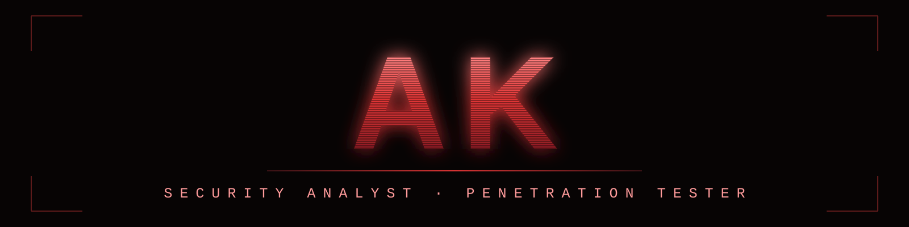
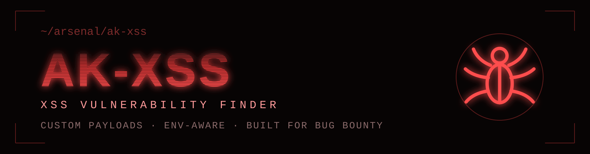
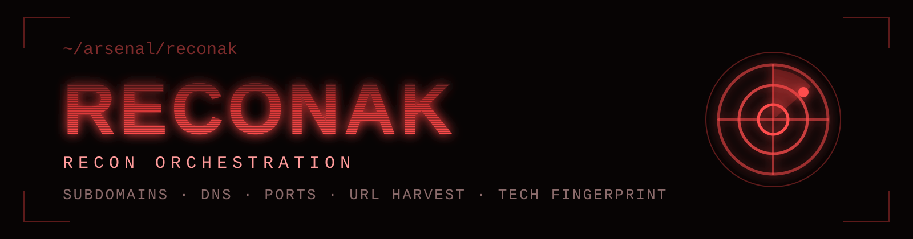

*I break systems before criminals do — and ship the tooling while I'm at it.*

  
  
  

---

## `:~$` ls ~/arsenal

Flagship builds — the offensive tooling I ship. Star counts are live.

  
  
  

A powerful cross-site scripting vulnerability finder with custom, environment-aware
payloads — built for real bug bounty targets, not lab exercises.

---

  
  
  

Full-spectrum reconnaissance in one run — subdomain enumeration, DNS, live host
filtering, ports, URL harvesting and technology fingerprinting.

---

<a href="https://github.com/AlaganAk?tab=repositories">→ browse all repositories</a>

---

## `:~$` cat skills.matrix

**`// operations`**

  
  
  
  

**`// engineering`**

  
  
  
  

**`// stack`**

  
  
  
  
  
  

---

## `:~$` sudo cat /var/log/clearance

  
  
  
  

---

## `:~$` tail -f /var/log/activity

<table>
  <tr>
    <td width="50%">
      
    </td>
    <td width="50%">
      
    </td>
  </tr>
</table>

<table>
  <tr>
    <td width="50%">
      
    </td>
    <td width="50%">
      
    </td>
  </tr>
</table>

<picture>
  <source media="(prefers-color-scheme: dark)" srcset="https://raw.githubusercontent.com/AlaganAk/AlaganAk/output/github-contribution-grid-snake-dark.svg" />
  <source media="(prefers-color-scheme: light)" srcset="https://raw.githubusercontent.com/AlaganAk/AlaganAk/output/github-contribution-grid-snake.svg" />
  
</picture>

---

## `:~$` ssh socials

  
  
  

<code>./decrypt --classified</code>

 

- 🏅 **NASA Hall of Fame '25** — letter of appreciation signed by NASA's Senior Agency
  Information Security Officer (SAISO), earned via responsible disclosure under NASA's VDP.
- 🎯 Currently hunting on **hackerone · bugcrowd · yeswehack**.
- 💬 Ask me about VAPT, Active Directory attacks, and building offensive tooling.
- ⚡ Root on the box is a side effect — the report is the deliverable.

---

**`─── EOF ───`** &nbsp; `exit 0`

*responsible disclosure only — open for collaboration on bug bounty, VAPT, and offensive security tooling*

